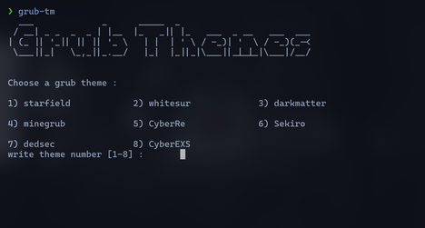

<h1 align="center">Grub Theme Manager</h1>

## What is Grub Theme Manager ?
A program written in Python, its goal is to manage GRUB themes.
The program reads the themes stored in themes directories, then waits for user input to choose a theme. Afterward, it edits the `GRUB_THEME` variable in the `/etc/default/grub` file and generates the configurations with the `grub-mkconfig` command.
<center>

</center>

## required packages

python : https://www.python.org/ <br>
python-pip : https://pypi.org/project/pip/ <br>
grub : use your package manager to install GRUB. <br>

> **Note**: Before you start downloading the project, you need to make sure that you have the required packages installed in your system.


## Setup
### Download the project
```
$ git clone https://github.com/KHLALA-Gh/grub-themes-manager.git
```
### installation
cd to the repo :
```
$ cd ./grub-themes-manager
```
run install.sh script
```
$ ./install.sh
```
### post installation
run Grub Themes Manager :
```
$ grub-tm
```

## Issues

### The program doesn't detect all my themes.
Grub Theme Manager searches for themes by default in this directories `/boot/grub/themes` and `/usr/share/grub/themes`. If you store your GRUB themes in another path you can add it to the `config.ini` file in the `themes_dirs` variable.
```ini
[DEFAULT]
themes_dirs=[
    "/boot/grub/themes",
    "/usr/share/grub/themes",
    # add your path here.
    "/your/themes/path"
    ]
...
```
> **Note** : A GRUB theme should have `theme.txt` file at its rout level.
### When I run `grub-tm` i get `[  ERROR  ] config file does not exist './config.ini'.`
If you encounter an error indicating that the `./config.ini` file doesn't exist, that means your config file is missing.
To fix this you need to download [config.ini](./config.ini) file and add it to the root level in grub-theme-manager directory.

### When I run `grub-tm` i get `KeyError` when parsing the config file
If you got any `KeyError` when parsing the config file,that probably means you have a missing property in the config file.You can know this missing property by reading the error.For example `KeyError 'grub_cfg'` means that `grub_cfg` is missing in the config file.To add it go to [config.ini](./config.ini) copy the missing property then past it in your config.ini file.

### When i am installing the project i get `[  ERROR  ] "grub-tm" already exists in {path} as an alias.`
That means you have already `grub-tm` alias in your initialization file (~/.bashrc,~/.zshrc,etc...).To fix it just remove the alias and run the install script again.

### None of these issues
If you encounter an issue not mentioned, please submit it in [issues](https://github.com/KHLALA-Gh/grub-themes-manager/issues)